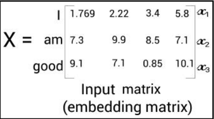
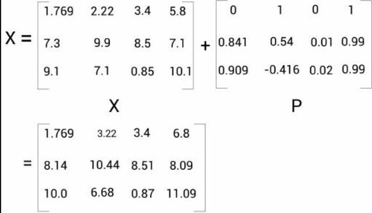
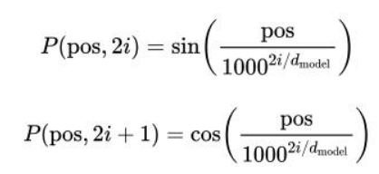
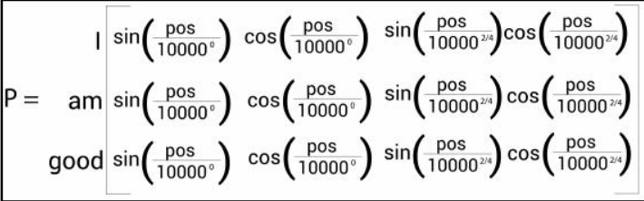
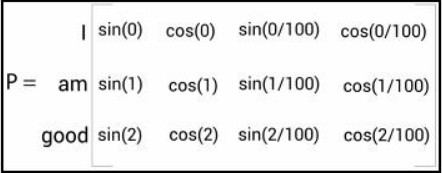
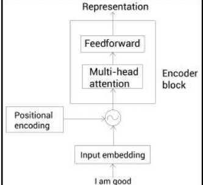
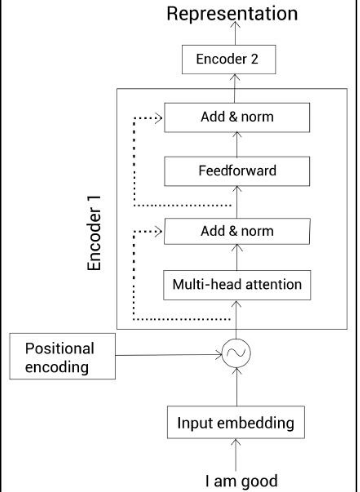
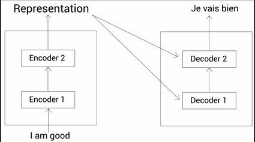
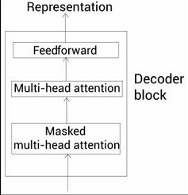

# Encodeur

## Multi head attention

On a une phrase : I am good. Chaque mot est représenté sou la forme dun vecteur de 512 entier grâce au word embedding. 

On sinterressera plus tard au word embedding; On suppose que le vecteur est une bonne représentatiob de nos mots.


On va créer 3 matrices : Q (query) ,K (Key) ,V (value)

On a aussi les matrices de poids W^Q , W^K, W^V initialisé en random

On multiplie la matrice X par les matrices de poids pour obtenir les matrice Q,K,V : 


q1, k1,v1, par opération matricielle a été généré par I

q2,k2,v2 a été généré par am ...

La dimension de q1 est un vecteur de 64. Donc la dimension de la matrice de poids est 512 * 64. 512 est variable mais pas 64 ?

X est de dimension 3*512, W^Q est de dimension 512 * 64, et donc Q est de dimension 3 * 64. La dimension qui nous intéressent à chaque fois est la dimension de l'espace d'arrivée (et donc pas lespace des words = nb de mots !). 

Step1 :

on multiplie Q par K^T . On rappelle que la première ligne de Q est lié à I, donc là on lie bien la phrase à elle-même en sortie.

QK^T multiple q1 par k1, et donc nous donne bien la similarité entre les q1 et k1.


Donc là on voit déjà que I est lié à I plus qu'à am ou good. Ces valeurs dépendent des poids des matrices : il faut les chercher !

Step2 :

On divise QK^T par la racine de la dimension de K. Ici, K est de dimension 3 * 64 et la dimension qui nous intéressent est 64 (dimension de l'espace darrivée). Et donc on divise par 8 :


On fait ca pour la recherche du gradient (plus stable).

Step3 :

On utilise softmax pour normaliser la sortie. Softmax donne une distribution de probabilité sur le vecteur d'entrée.

Softmax est de dimension 3 * 3 : les dimensions initiales de l'espace de départ.


Pour obtenir l'attention, on multiplie notre softmax par V :


Softmax est de dimension 3 * 3 et V est de dimension 3 * 64. Donc Z est de dimension 3 * 64 également. 

On obtient ça en réponse :


Sauf que on na pas 64 colonnes. Donc on a un truc en plus à faire. 

En fait, c pas vraiment une multiplication matricielle :


Bon c'est un peu bizarre mais c'est ça.

z1 contient 90% de linformation de v1, 7% de linformation de v2 et 3%100 de v3.

Le mécanisme d'attention dit sur quoi chaque mot doit se focaliser sur le reste de la phrase. Par ex dans la phrase "J'aime les fleurs qui sont rouges.". qui se référe à fleurs  et donc z5 contiendra presque 100% de v4 (fleurs). Et en fait un peu "les". 

Conclusion et récaptiulatif :

Voici la formule finale de Z :


QK^T permet d'avoir la similarité entre les mots. Z est l'attention.

## La nécessité de faire plusieurs matrice d'attention

Prenons la phrase : "A dog ate the food because it was hungry"


Ici, it peut se référer à dog mais pourrait tout aussi bien se référer à food ! Ici, l'algo s'est pas trompé mais il aurait très bien pu dans une autre phrase.

On crée donc une deuxième matrice d'attention comme suit :


On obtient alors h matrices d'attention. On peut alors obtenir le multi head attention en les concaténant et en multipliant par une nouvelle matrice de poids :


## Positional encoding

Dans un RNN, on donne la phrase mot par mot. Et on peut repérer la position dun mot relativement au précédents

Avec un positional encoding, on donne la phrase entière. 

Prenons un exemple, supposons que d_model  = 4 est la dimension de notre word embedding.On a donc une matrice de 3 * 4 pour notre phrase "I am good".

On a donc ça :



Le positional encoding vient avant le multi head !!

Voici la matrice P encoding qui est aussi une matrice 3 * 4 :



En fait, on va utiliser ça :



Pos est la position de notre mot dans la phrase (am est en position 1) et i la position dans notre word embedding.

Cela donne :



Pour chaque entier de notre word embedding, on transforme chaque entier en appliquant alternativement le sinus et le cosinus. On fait donc bien intervenir la position du mot. 

On obtient alors 



Mais pk sinus et cosinus ?

IDK 

Finalement la l'architecture est :



## FFN

Il nous reste le Feed Forward Network. On a abandonné le RNN pour le FFN (paraléllisme).

FFN -> 2 couches denses avec Relu activations.

## Add and Norm


Elle permet de connecter la multi head avec le FFN. 

Elle permet de normaliser les valeurs pour quelles n'augmentent pas exponetiellement.

Finalement l'encodeur est :



On peut mettre autant dencodeur quuon veut a la suite.

# Décodeur

Voici une image :



Architecture du decoder :



Rappel :


Le décodeur prend Je vais bien en entrée. On rajoute sos comme charactère de début. On applique le word embedding puis le positionnal encoding.

```

```
